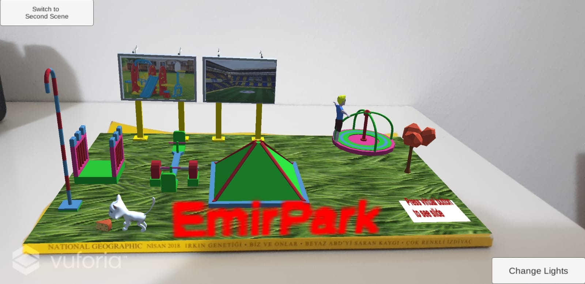
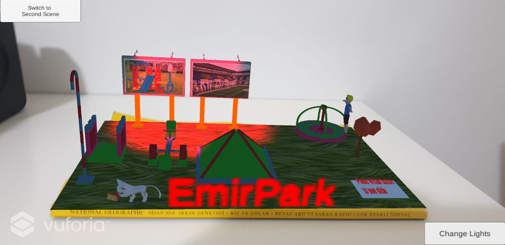
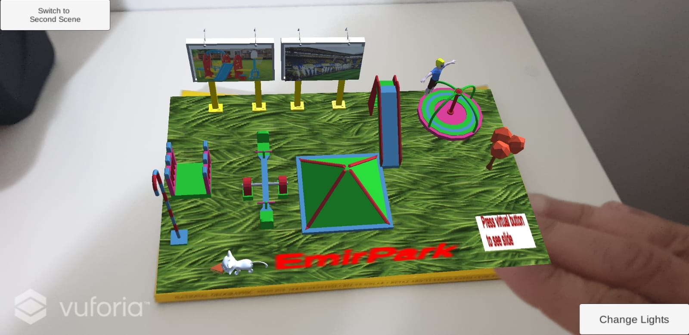
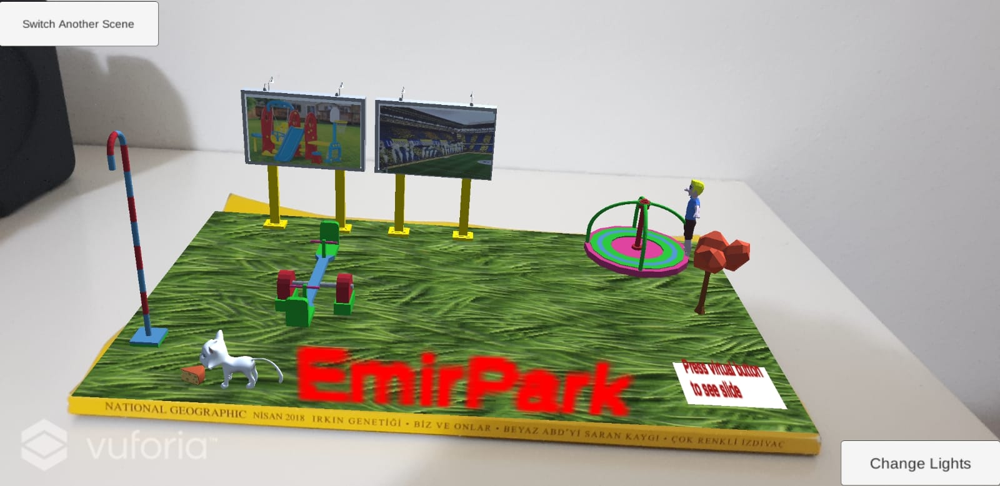
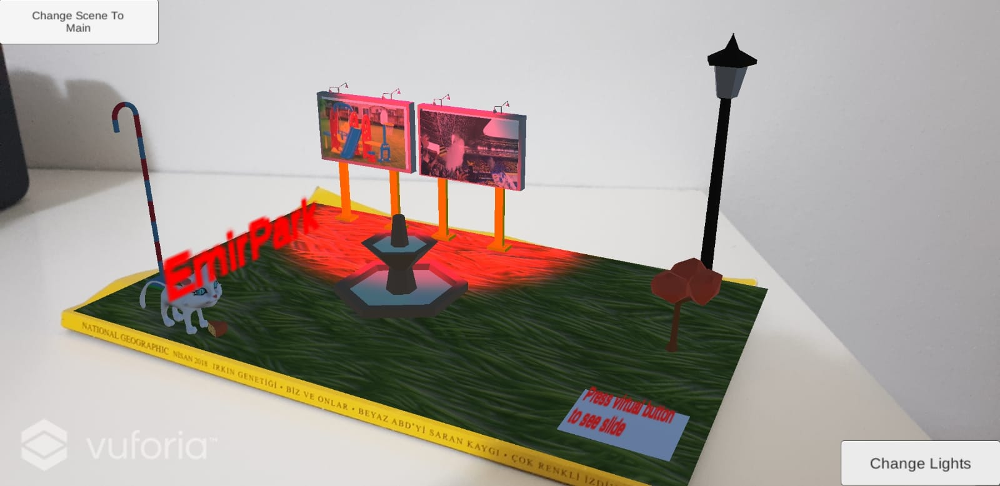

# AR-App---EmirPark
Augmented Reality App

There is an Augmented Reality Basic Application. The image target is National Geographic cover. 
The objects are below:

- Stationary Virtual Objects : Fireman Pole, Playground Roof, Walkway, Seesaw, Cheese, Billboard, Fountain
- Animated Virtual Object : Cat (From Asset Store), Roundabout (I created the animations)
- Moving Object : Tree 
- Textual Virtual Object : EmirPark
- Picture : Kids park picture on billboard1
- Video : Fenerbahce Fan Video
- Three-step scenario where the user is interacting with the virtual objects : There is a button in each scenario.If you
click the button, you can change the scenarios which has some different objects. I have 3 different scenario for this.
- One step involving the (user) selection of a virtual object : If you press the virtual button (right bottom), a slide will appear 
- One step involving the (user) selection of a button to change scenarios : There is a button at right bottom. If you press it, the lights will change.

Unity 2020.3.21f1 and Vuforia Engine 10.2.5

[Target Image](https://github.com/emiruzun0/AR-App---EmirPark/blob/main/Assets/GroundPicture/bground.jpg)

